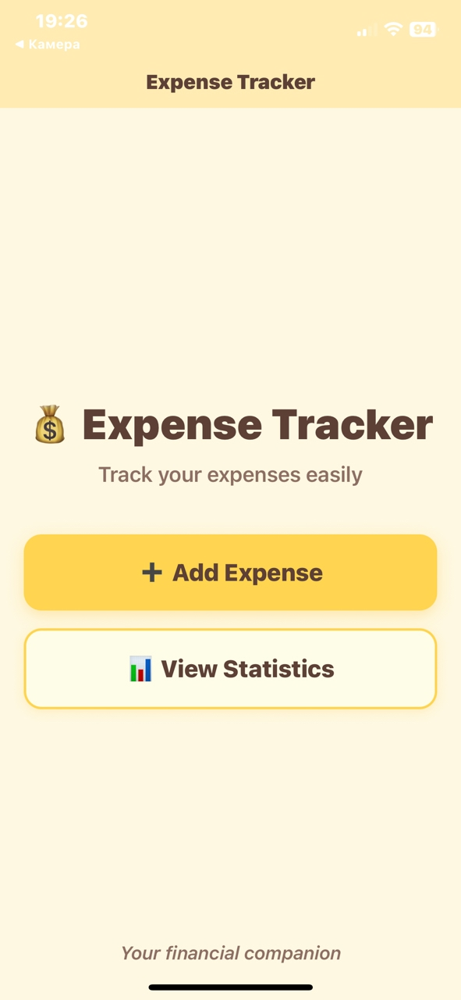
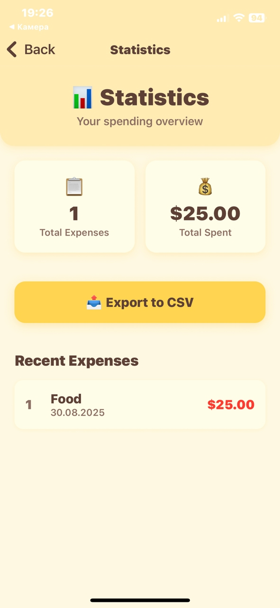
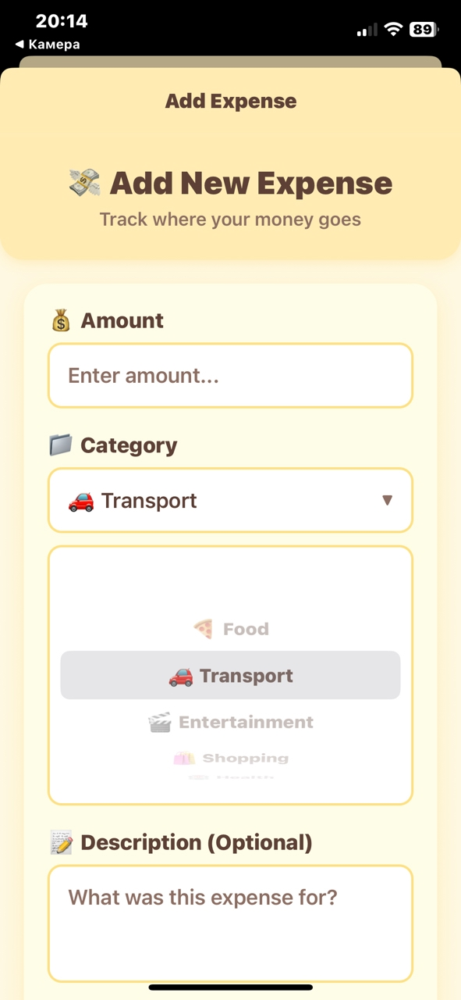
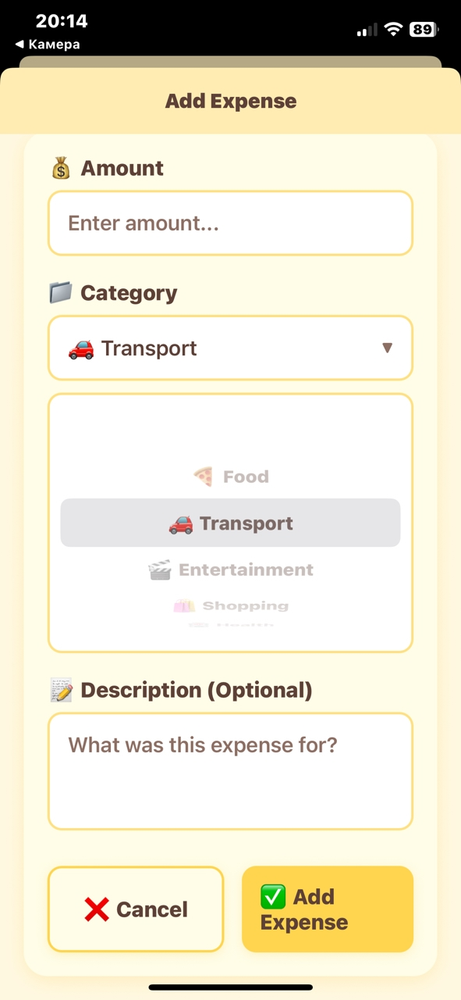

# 💰 Expense Tracker

A beautiful mobile expense tracking app built with React Native, TypeScript, and Expo.

## ✨ Features

- ➕ Add expenses with categories
- 📊 View statistics and totals  
- 📤 Export data to CSV
- 🎨 Beautiful bed-yellow themed UI
- 📱 Cross-platform (iOS & Android)


## 🛠️ Built With

- React Native
- TypeScript
- Expo
- Expo Router
- AsyncStorage

## 📸 Screenshots








👨‍💻 Author: abdullagezgiev

💖 Support
If you liked this project, please like (give me ⭐️) it on GitHub!

## 🚀 Getting Started

```bash
# Install dependencies
npm install

# Start development server
npx expo start


